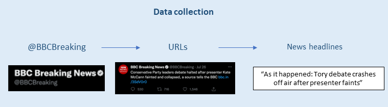

# Is sentiment in the news becoming more negative over time? 

A recent [report](https://reutersinstitute.politics.ox.ac.uk/digital-news-report/2022/dnr-executive-summary) published by the Reuters Institute for the Study of Journalism analysing news consumption across different countries unveiled the increase in news avoidance. Among the reasons, one of the most common answers by interviewees was that ‘news negatively affect their mood’: 

>'The proportion of news consumers who say they avoid news, often or sometimes, has increased sharply across countries. This type of selective avoidance has doubled in both Brazil (54%) and the UK (46%) over the last five years, with many respondents saying news has a negative effect on their mood'. (Digital News Report, 2022)

However, in other countries like Germany, Sweden, Switzerland, Finland and Netherlands the variation was not considerable. 

This project compared the sentiment of news articles published by BBC on twitter in 2017, 2019 and 2022 to see if there is a variation of sentiment in the language used by news articles over time that could be related to how people feel the effect in their mood.  

## Data Collection

The data collection consisted of the following steps:

1. Getting tweets from @BBCBreaking timeline for specific years (2012,2015,2017,2019 and 2022) using the Twitter API.
- Packages used: Twarc2.
2. Filtering the tweets data to get only the url for news articles published by @BBCBreaking.
- Packages used: Pandas.
3. From the list of urls, using Newspaper3k to scrape the news headlines from the articles' webpages. After getting the list of news headlines, we removed the duplicate results as @BBCBreaking tweeted some articles more than once. 
- Packages used: Newspaper3k (Beautiful Soup & NLTK), Pandas.

The image below illustrates the data collection pipeline:

## Dataset description:

The dataset is in `.csv` format and is organised as follows:
- Columns:
  - ID (tweet ID)
  - created_at (tweet publication's date)
  - url (url of the news article attached to the tweet)
  - Titles (news headline)
- Rows:
Each row contains a single news article headline. Total number of entries: XX

The image below shows the dataset overview:

## Data Analysis

