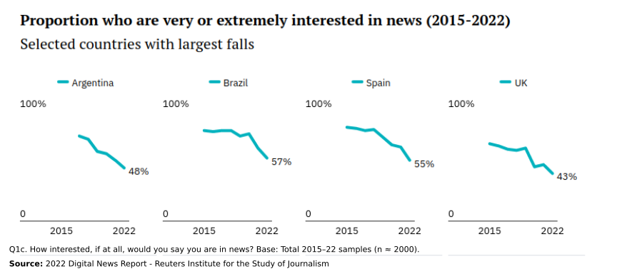

# Is Sentiment in the news becoming more negative over time? 

Description of the project here 

>'The proportion of news consumers who say they avoid news, often or sometimes, has increased sharply across countries. This type of selective avoidance has doubled in both Brazil (54%) and the UK (46%) over the last five years, with many respondents saying news has a negative effect on their mood'. (Digital News Report, 2022)

